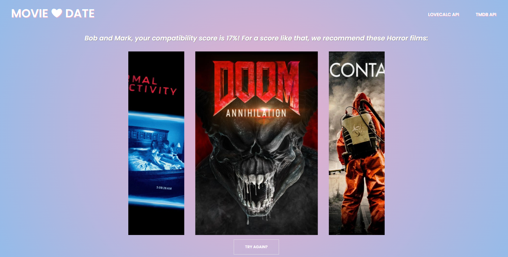

# movie_date

## Website Description
* User clicks calculate compatibility button
* User inputs two names to view compatability %
* User is presented with their compatability % & 6 random movie titles from a genre based on their %
* Create a history of what names user already searched for and allow user to reload the movie titles when the user clicks on button created in history for those names

## Technologies Used
* [Love Calc API](https://rapidapi.com/ajith/api/love-calculator/)
* [The Movie Database API](https://developers.themoviedb.org/3/getting-started/introduction)
* UIkit for CSS framework
* Jquery
* Javascript
* HTML

## Final Website Screenshot

## Link to Deployed Website
[Movie Date Deployed Website](https://danielolvera21.github.io/movie_date/)
